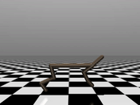

# DDPG

Deep Deterministic Policy Gradient for continuous action spaces, an early
gradient based approach to continuous control.

<p>
  
</p>

<p align="center">
  
</p>

## Run summary

| Item | Result |
| --- | --- |
| Training steps | 20,000,000 |
| Training time | 6 minutes 6 seconds |
| Speed | 54,600 SPS |
| Solved | ✅ |

## Environment

- Package: Brax
- Backend: MJX
- Environment: HalfCheetah
- Action space: Continuous

<p>
  
</p>

## Core algorithm

The critic target uses the target actor and target critic:

```text
y = r + gamma * (1 - done) * Q_target(s', mu_target(s'))
```

The critic minimizes the squared error:

```text
L_critic = mean((y - Q(s, a))^2)
```

The actor maximizes the critic's estimate of its actions:

```text
L_actor = -mean(Q(s, mu(s)))
```

Target networks are updated with a soft update:

```text
theta_target = (1 - tau) * theta_target + tau * theta
```

<p>
  
</p>

## Run

```bash
uv run python -m ddpg.main --rng 0
```
