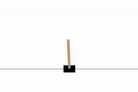

# DQN

Deep Q-learning for discrete action spaces, one of the first mainstream deep
RL algorithms.

<p>
  
</p>

<p align="center">
  
</p>

## Run summary

| Item | Result |
| --- | --- |
| Training steps | 1,000,000 |
| Training time | 7 seconds |
| Speed | 43,000 SPS |
| Solved | ✅ |

## Environment

- Package: Gymnax
- Environment: CartPole-v1
- Action space: Discrete

<p>
  
</p>

## Core algorithm

The target value is calculated with a separate target network:

```text
y = r + gamma * (1 - done) * max Q_target(s', a')
```

The online network is trained with the squared temporal difference error:

```text
L = mean((y - Q(s, a))^2)
```

The target network is copied from the online network at a fixed gradient
update interval.

<p>
  
</p>

## Run

```bash
uv run python -m dqn.main --rng 0
```
