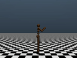

# PPO

Proximal Policy Optimization for continuous action spaces, a major step toward
practical locomotion training.

<p>
  
</p>

<p align="center">
  
</p>

## Run summary

| Item | Result |
| --- | --- |
| Training steps | 50,000,000 |
| Training time | 2 minutes 21 seconds |
| Speed | 348,600 SPS |
| Solved | ✅ |

## Environment

- Package: Brax
- Backend: MJX
- Environment: Humanoid
- Action space: Continuous

<p>
  
</p>

## Core algorithm

PPO compares the current policy with the policy that collected the data:

```text
r_t(theta) = exp(log pi_theta(a_t | s_t) - log pi_old(a_t | s_t))
```

The clipped policy objective limits how far the policy can move in one update:

```text
L_policy = -mean(min(r_t * A_t, clip(r_t, 1-epsilon, 1+epsilon) * A_t))
```

The value function and entropy terms are added to form the total loss:

```text
L = L_policy + vf_coefficient * L_value - entropy_cost * H
```

<p>
  
</p>

## Run

```bash
uv run python -m ppo.main --rng 0
```

> [!TIP]
>
> A chunk of this PPO implementation is inspired by Brax's PPO training
> [implementation](https://github.com/google/brax/blob/main/brax/training/agents/ppo/train.py).
